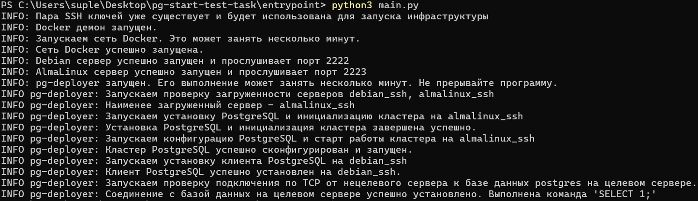

# Оглавление

1. [Задача](#задача)  
2. [Решение](#решение)  
   - 2.1. [Дисклеймер](#дисклеймер)  
   - 2.2. [Инструкция по сборке](#инструкция-по-сборке)  
     - 2.2.1. [Требования к окружению](#требования-к-окружению)  
     - 2.2.2. [Шаги сборки](#шаги-сборки)  
     - 2.2.3. [Проверка работоспособности](#проверка-работоспособности)  
   - 2.3. [Введение](#введение)
   - 2.4. [Архитектура решения](#архитектура-решения)
   - 2.5. [Алгоритм работы](#алгоритм-работы)
---

# Задача

Реализовать консольное приложение, которое будет устанавливать PostgreSQL на удаленный хост, настраивать и запускать.

Вводные: 2 сервера, один на Debian, второй на CentOS (AlmaLinux). На обоих серверах пользователю root подложен один и
тот же открытый ssh ключ. У исполнителя есть закрытая часть ключа, с помощью которой он подключается.


**Реализация должна включать:**

- подключение к удаленным хостам по ssh
- оценку загруженности серверов, выбор наименее нагруженного из серверов как целевого
- инсталляцию PostgreSQL на целевой хост
- настройку PostgreSQL для приема внешних соединений, т.е. БД должна отвечать на sql-запросы с внешних ip-адресов
- настройку подключения пользователя “student” к PostgreSql только с ip адреса второго сервера.

**Требования**

- приложение принимает один строковый параметр - ip адреса или имена серверов одной строкой, разделитель - запятая
- приложение должно сообщать статус выполнения инсталляции

**Будет плюсом**

- приложение выполняет проверку работы БД, выполняя sql запрос (SELECT 1)

**Требования к коду**

- язык разработки: bash, python, ansible
- библиотеки можно использовать любые
- код должен быть выложен на Github с Readme файлом с инструкцией по запуску и примерами. Важно, чтобы по инструкции
  можно было запустить код и он работал
- при возникновении вопросов по ТЗ оставляем принятие решения за тобой.

Желательно отразить в Readme, какие вопросы возникали и какие решения были приняты

---

# Решение

## Дисклеймер

Изображения в `README.md` могут загрузиться не сразу, дождитесь полной загрузки.

## Инструкция по сборке

### Требования к окружению

**Для успешной сборки необходимо установить:**

- `Docker`
- `python3`, `pip`

### Шаги сборки

1. Скачать проект

```bash
git clone https://github.com/bashkir777/pg-start-test-task
```

2. Перейти в корень проекта

```bash
cd pg-start-test-task
```

3. Установить необходимые зависимости

```bash
pip install -r entrypoint/requirements.txt
```

4. Убедиться, что docker демон запущен, если нет — запустить

```bash
docker info
```

5. Зайти в директорию `entrypoint`. **Обязательный шаг**

```bash
cd entrypoint
```

6. Запустить файл `main.py` и дождаться завершения работы.

```bash
python3 main.py
```

После этого будет инициализирована вся инфраструктура проекта и запущена программа `pg-deployer`. Выполнение программы
может занять несколько минут.

### Проверка работоспособности


Пример логов, которые будут получены, после выполнения программы:  


Чтобы ознакомиться с результатами работы программы более подробно, можно подключаться к docker контейнерам с
использованием вкладки `Exec` в UI Docker Desktop (либо через терминал)

Пример, как можно убедиться, что кластер postgres действительно сконфигурирован и запущен.  


## Введение

Для удобства проверки и отсутствия расходов на виртуальные машины я решил реализовать поставленную задачу с
использованием docker контейнеров, которые эмулируют реальные сервера.

Я разбил задачу на три части:

1. Написание [пакета](entrypoint/infra_entrypoint/README.md), предоставляющего инфраструктуру для выполнения ТЗ (два
   Linux сервера, с работающими ssh-демонами, и сервер с Ansible Control Node)
2. Написание [приложения](pg-deployer/README.md) по ТЗ (далее `pg-deployer`), которое будет загружено на Ansible Control
   Node.
3. Написание входной точки — задача которой инициализировать сборку инфраструктуры, дождаться её завершения,
   подключиться к Ansible Control Node и запустить `pg-deployer`, передав входными параметрами имена серверов.


## Архитектура решения

Если не отображается, поставьте светлую тему в браузере.


## Алгоритм работы

1. **Развертывание инфраструктуры**
- Генерация пары ssh ключей.
- Развертывание Docker сети состоящей из трех контейнеров (AlmaLinux, Debian, Ansible Control Node).
- Публичный ssh ключ загружается на AlmaLinux и Debian сервера, в директорию `/root/.ssh/authorized_keys`.
- Публичный и приватный ключ загружаются на Ansible Control Node в директории `/root/.ssh/id_rsa.pub` и `/root/.ssh/id_rsa` соответственно.
- На серверах AlmaLinux и Debian устанавливаются и запускаются ssh сервера.
- На серверах AlmaLinux, Debian и Ansible Control Node устанавливается `Python`.
- На Ansible Control Node загружается `Ansible`.
- На Ansible Control Node загружается `pg-deployer` и набор playbook-ов для его работы.
- Порты, проброшенные на хост из контейнеров в которых запущены AlmaLinux и Debian серверы пингуются, чтобы убедиться, что ssh сервера работают.
- Подключаемся к контейнеру в котором развернут Ansible Control Node через `exec` и запускаем `pg-deployer`.

2. **Работа pg-deployer-а**
- Запускает playbook `check_load.yml` и анализирует его результаты.
- Сначала проверяется достаточно ли оперативной и дисковой памяти на хостах. Если достаточно на обоих, то для деплоя `postgres` выбирается хост с минимальной загрузкой cpu.
- Запускает playbook-и `install_postgres_server.yml` и `configure_postgres_server.yml`, которые устанавливают, настраивают и запускают кластер `postgres` на целевом хосте в соответствии с ТЗ.
- Запускает playbook `install_postgres_client.yml` на нецелевом хосте для скачивания клиента postgres-а.